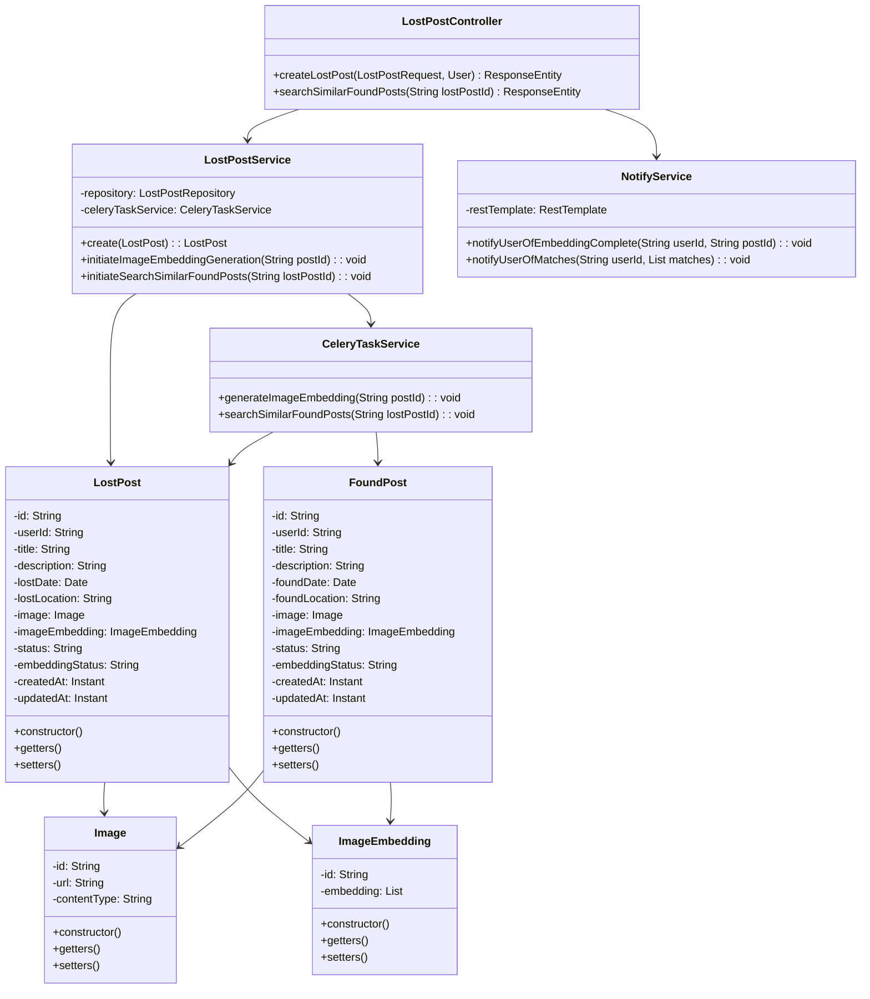

# DISSERTATION

```mermaid
classDiagram
    class LostPostController {
        +createLostPost(LostPostRequest, User) ResponseEntity<BaseResponse>
        +searchSimilarFoundPosts(String lostPostId) ResponseEntity<BaseResponse>
    }
    class LostPostService {
        -repository: LostPostRepository
        -celeryTaskService: CeleryTaskService
        +create(LostPost): LostPost
        +initiateImageEmbeddingGeneration(String postId): void
        +initiateSearchSimilarFoundPosts(String lostPostId): void
    }
    class CeleryTaskService {
        +generateImageEmbedding(String postId): void
        +searchSimilarFoundPosts(String lostPostId): void
    }
    class NotifyService {
        -restTemplate: RestTemplate
        +notifyUserOfEmbeddingComplete(String userId, String postId): void
        +notifyUserOfMatches(String userId, List<FoundPost> matches): void
    }
    class LostPost {
        -id: String
        -userId: String
        -title: String
        -description: String
        -lostDate: Date
        -lostLocation: String
        -image: Image
        -imageEmbedding: ImageEmbedding
        -status: String
        -embeddingStatus: String
        -createdAt: Instant
        -updatedAt: Instant
        +constructor()
        +getters()
        +setters()
    }
    class FoundPost {
        -id: String
        -userId: String
        -title: String
        -description: String
        -foundDate: Date
        -foundLocation: String
        -image: Image
        -imageEmbedding: ImageEmbedding
        -status: String
        -embeddingStatus: String
        -createdAt: Instant
        -updatedAt: Instant
        +constructor()
        +getters()
        +setters()
    }
    class Image {
        -id: String
        -url: String
        -contentType: String
        +constructor()
        +getters()
        +setters()
    }
    class ImageEmbedding {
        -id: String
        -embedding: List<Float>
        +constructor()
        +getters()
        +setters()
    }

    LostPostController --> LostPostService
    LostPostController --> NotifyService
    LostPostService --> LostPost
    LostPostService --> CeleryTaskService
    CeleryTaskService --> FoundPost
    CeleryTaskService --> LostPost
    LostPost --> Image
    LostPost --> ImageEmbedding
    FoundPost --> Image
    FoundPost --> ImageEmbedding
```
